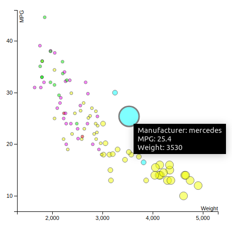
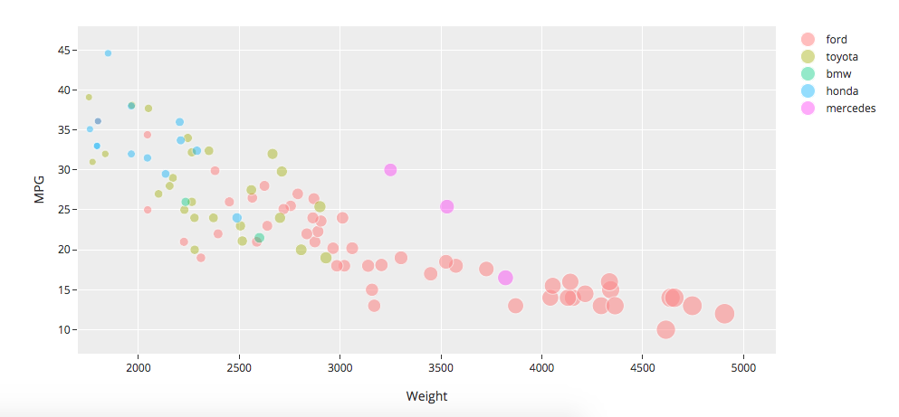

REMEMBER:
- image: url "title"
- not required Achievements

# 02-DataVis-10ways

Assignment 2 - Data Visualization, 10 Ways  
===

# Python + matplotlib
It was a bit tricky when debugging the python program (I had lots of syntax errors). Also, in order to get the size of the points in function of the weight, I was checking when a weight on the table was >= 4000, then I added to the array of sizes the size 200, when it was between 3000 and 4000, then I would add a size of 100 for that point, and the same thing with the weights <= 3000. Hence, I hade a larger code only because of these if-else statements.

On the positive side, it was easy and fast to make the first version of the scatterplot. It also had a fast interpreter/parser of the csv file.

# R + ggplot2

I used the RStudio IDE for this project. R is rally helpful when it comes to csv files: I literally just had to tel the program which file contained the data and that was all for the parsing part. Another thing was that I didn't have to write any for/while loop as I did when I used Matplotlib. Also I have to highlight the fact that doing this scatterplot it took me only 4 lines of code!

  //TODO CHANGE THIS

# JavaScript + HTML + CSS + d3

Tutorial:
http://bl.ocks.org/jfreels/6816504

The library is pretty complex and seems impossible to understand at first how it works but taking an example from internet and starting modifying the parameters to see how it works is the way I learned a bit of d3.

I found d3 very flexible when it comes to defining a function inside an attribute.

I tried removing the 2 points that had MPG=NA using

`.attr('cx',function (d) {
        if (d.MPG != 'NA') {
          return xScale(d.Weight);
        }
      })
      .attr('cy',function (d) {
        if (d.MPG != 'NA') {
          return yScale(d.MPG);
        }
       })`

but this did not solve my problem because where the points just moved to the top left of my representation:

Afterwards, I did the same thing with the radius, which solved my problem:

`if (d.MPG != 'NA') {
          var weight = d.Weight;
          if (weight >= 4000) {
            return 8;
          } else if (weight >= 3000) {
            return 5;
          } else {
            return 3;
          }
        }`

The advantatges of d3 are:
- I did not have to do any for/while loops,
- it is very easy to manipulate the data you want to represent because you only need to change the inner code of the attribute methods!
- it is handy if you want to include personalized animations.

I would totally recommend this library for data visualizations.

## Technical & Design Achievements:

I learned how to use the transition() function. My scatterplot has an animation that when the mouse stops over a point, the point is magnified and a tag with details (manufacturer, weight and MPG) pops up:

# 4. Flourish
It is not that flexible as using a library, but still it was fast to use and produce a scatterplots in less than an hour.

## Technical Achievements:
It took me some time to determine how to scale the size of the points after setting it in function of the weight (they were very big initially).

## Design Achievements:
I also I have the scatterplot showing a tag with detailed information of the point every time the mouse stops on it. I also made it to have the background grid.

# 5. RawGraphs
Link to the online tool: https://rawgraphs.io/

It is not so flexible when it comes to what points I want to add from the dataset, the tags (the scatterplot is really ugly with the tags activated):

- The difference in size it is not that visible and I cannot scale the sizes.
- I can only change the data that is represented on the X and Y-Axis, the color, size and label of the points, but nothing else.
- It is fast if I only need to visualize some dataset quickly.

# 6. SPSS
Tutorial: https://statistics.laerd.com/spss-tutorials/scatterplot-using-spss-statistics.php
 It is not flexible when it comes to reading the csv dataset, or at least it is quite difficult for a begginer to understand all the steps
 in parsing correctly the data with this programs. This lead to errors in the Manufacturer column. When I set the color to be in function of the Manufacturer, the program found more manufacturers than it should find, hence there are more colors in this scatterplot than manufacturers.

I also did some research and seems impossible to change the size of the circles iso that it depends the weight.

I won't use this program never ever again in the future.

### Design Achievements
I achieved to add the background grid.

# 7. Matlab
After running the scripts that plots the scatterplot, it has an editor that makes it super easy to modify the chart, for example erase points that satisfy MPG=NaN.

## Design achievements:
I used a pastel color palette for this scatterplot.

# 8. Plotly Chart Studio
Online tool: https://plot.ly/create/line-of-best-fit/#/
It is really easy to use and nice interface.

# Technical Achievements
It took me some time to figure out how to change the size of circles in function of the weight

# 9. scatterplot.online
Online tool: https://scatterplot.online/
One of the fastest online scatterplot creators after flourish. I only had an error once that the values of the y-axis were not represented, but just refreshing the web page, it worked perfectly again. I would recommend this tool.

# Design Achievements
The colors are compatible. I also changed the color of the background.

# Technical Achievements
I did a workaround to get the transparency effect: turning the background black.

# 10. TIBCO Spotfire
Easy to use and user-friendly interface.

## Design Achievements
I have added the legends on a side of the representation.

# Tableau
I is quite easy to use after determining how to make it represent any data on the screen.

## Design Achievements
I have added a tag with details for every point.

